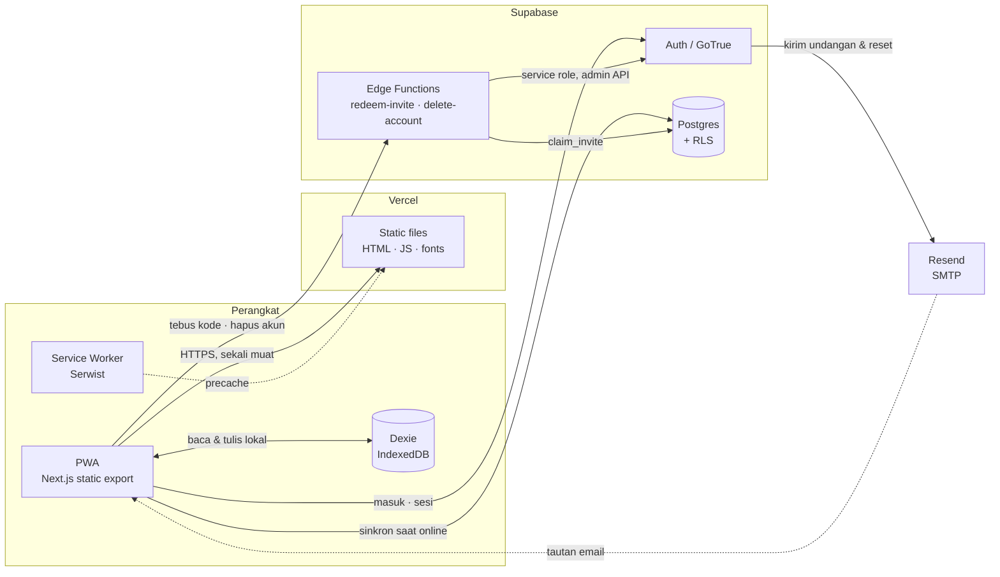
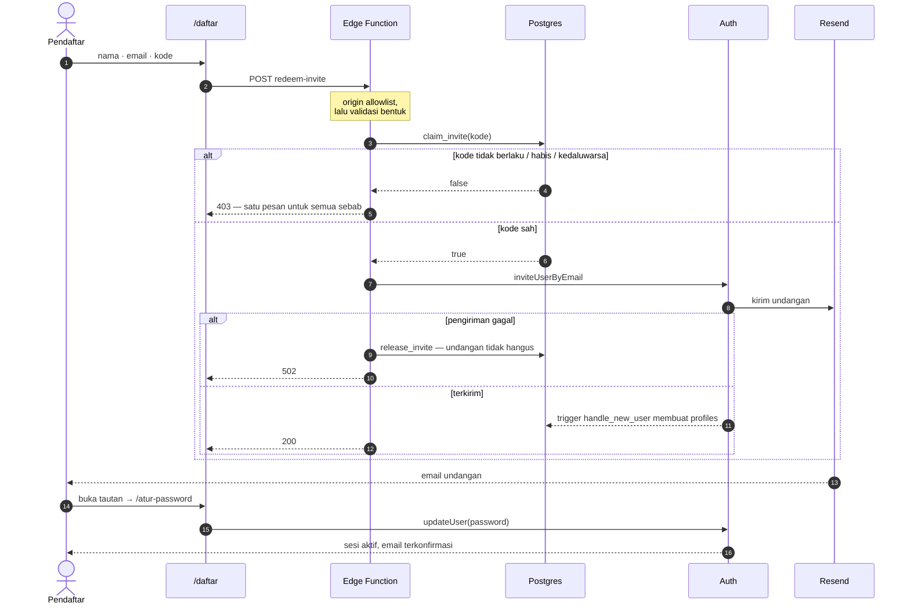
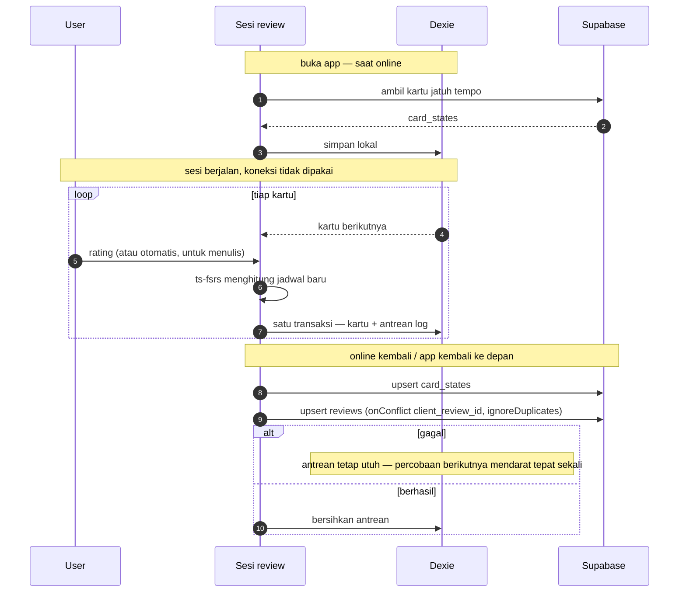
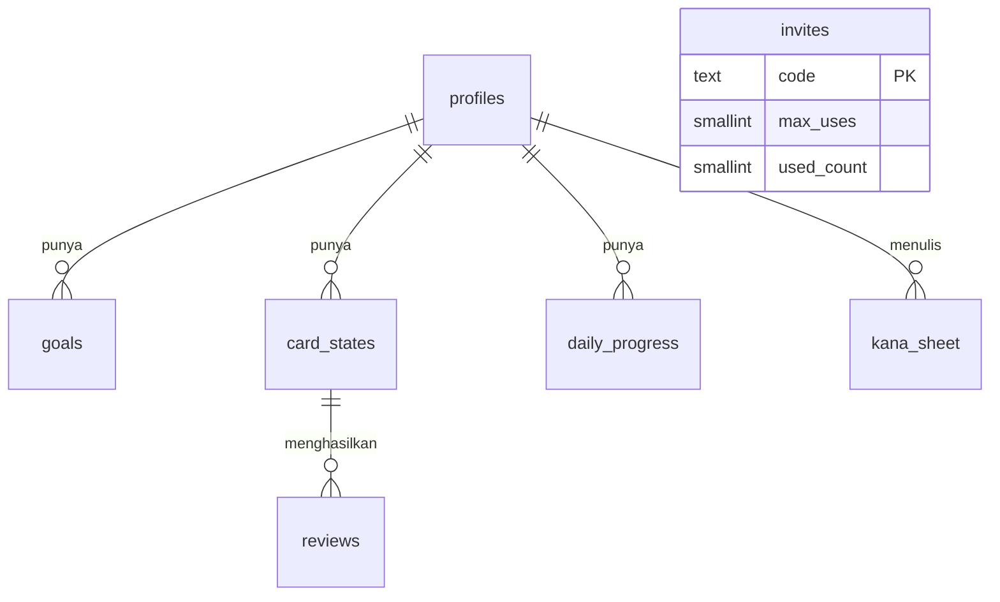

# Masume — architecture

The source of truth for how this system fits together. It lives in the repo so it
changes in the same commit as the code it describes; a diagram kept anywhere else
drifts the moment someone forgets to update it.

GitHub renders the Mermaid blocks below directly.

**Last verified against production:** 5 August 2026, after the generalisation —
migrations `0005`+`0006` applied (households and `progress_summary` gone, every
policy own-rows-only), `redeem-invite` v3 and `delete-account` v1 deployed, auth
flow end to end (invite → email → set password → session), Edge Function origin
allowlists, offline sync tests, and both signup doors probed directly.

---

## 1. The whole system

One fact shapes everything else: **there is no server tier**. `output: 'export'`
means Vercel serves static files and nothing more — no API routes, no middleware, no
server components that fetch. Every read and write goes from the browser straight to
Supabase.

That has one hard consequence, and it is worth stating plainly: **RLS is the only
security boundary.** Route guards in the client are a presentation concern; anyone
can walk past them with devtools.

**Why each piece is there**

| Piece | Reason it exists |
|---|---|
| Static export | One build serves Vercel *and* drops into a Capacitor WebView in Phase 1/2 without a rewrite |
| Dexie | Reviewing on a train is the main use case, not an edge case |
| Service worker | Home-screen install, offline shell |
| Edge Functions | The only things that may hold the service role key — one to enter (`redeem-invite`), one to leave (`delete-account`) |
| Resend | Supabase's built-in SMTP is capped at 2 emails/hour and documented as test-only |

---

## 2. Getting an account

Registration is self-serve, but gated: **the invite code is the credential**. That
is the whole auth story of signing up — which is why `verify_jwt` is off on
`redeem-invite` (someone signing up cannot possibly present a JWT yet), and why the
code is checked **inside the Edge Function**, never in the browser, because anything
checked in the browser can be walked past. Opening registration to the public —
dropping the code — is a later phase, and needs rate limiting and bot protection
first.

`/auth/v1/signup` is Supabase's own endpoint and answers regardless of our page, so
**"Allow new users to sign up" stays off** in the dashboard; the admin API inside
the Edge Function is the only way a user row can come into existence. Both doors
were probed directly on 5 August 2026:

| Door | Probe | Result |
|---|---|---|
| `/auth/v1/signup` | POST with a deliberately short password | `422 signup_disabled` — closed |
| Edge Function → admin API | invite an address that already has an account | `409 already registered` — still reaching GoTrue, so unaffected |

The second probe is the one worth keeping: it proves closing the side door did not
close the front one. A `signup_disabled` there would have meant invitations were
broken too, and nobody would have found out until the next person tried to join.

**Three details that matter**

- **No password passes through the Edge Function.** It sends an invitation; the
  recipient sets a password from the emailed link. Email verification becomes part of
  the flow rather than a step that can be skipped.
- **`claim_invite` is a conditional UPDATE returning a boolean**, so two people
  racing for the last use cannot both win — and since the generalisation there is no
  household to return or link. The signup trigger creates the profile row and the
  function's work is done; an account is just an account.
- **One rejection message for every reason.** Telling an unauthenticated caller
  apart "no such code" from "already used" hands them a way to probe the table one
  guess at a time.

---

## 3. Leaving: delete-account

Both stores require it — App Store guideline 5.1.1(v) and Google Play's
data-deletion policy both say an account created in the app must be deletable from
the app. `delete-account` is that path, reached from Setelan behind a typed
confirmation.

Its security model is one sentence: **the JWT is both the authentication and the
target.** `verify_jwt` is on at the gateway, the function resolves the caller from
their own token (`getUser()` as defense in depth), and no user id is accepted from
the body — so the caller can only ever delete themselves. The service-role client
then calls `admin.deleteUser`, and every user-keyed table (`profiles`, `goals`,
`card_states`, `reviews`, `daily_progress`, `kana_sheet`) carries
`ON DELETE CASCADE` to `auth.users`, so the data goes with the account atomically —
nothing left behind to sweep up later. The client finishes the job on its side:
Dexie `clearAll()` wipes IndexedDB before the local sign-out.

---

## 4. The daily loop, offline first

The session never touches the network. It reads from IndexedDB and writes to a local
queue; syncing happens later, in the background, or not today.

Every queued row carries a **client-minted id**. That is the whole idempotency story:
a retried push writes the same key, the unique constraint absorbs it, and a flaky
connection can neither duplicate nor lose a review.

Conflict handling: `reviews` is append-only so merging is trivial; `card_states`
is last-write-wins on `last_review`.

---

## 5. Who can see what

Since the generalisation the answer is uniform: **your own rows, nothing else.**
Migration `0005` dropped the family machinery — the `households` table, the
denormalised `progress_summary` that existed only so family members could read each
other's numbers, the `household_id` columns, and the `current_household_id()`
helper — and collapsed every policy to owner-only. Shorter policies are harder to
get wrong.

| Tabel | Siapa boleh lihat | Policy |
|---|---|---|
| `profiles` | Pemiliknya saja | `id = auth.uid()` |
| `goals`, `card_states`, `reviews`, `daily_progress`, `kana_sheet` | Pemiliknya saja | `user_id = auth.uid()` |
| `invites` | **Tidak seorang pun** — nol policy | RLS aktif tanpa policy = tertutup total; hanya service role di Edge Function |

`invites` stands alone in the diagram on purpose: since `0005` it references
nothing — a code is a bearer credential for a signup, not a membership in anything.

---

## 6. One dictionary, every string

All UI strings live in `src/lib/i18n/id.ts` as a typed dictionary —
`Dictionary = typeof id`, so the Indonesian file *is* the schema. Components read it
through `useT()`; module-scope code (error tables, manifest, metadata) imports `t`
directly.

The payoff is the shape of a future locale: a second language is a sibling file
declared `satisfies Dictionary` — the compiler lists every missing or extra key —
and the only file that changes behaviour is `src/lib/i18n/index.ts`, where `useT()`
starts picking a dictionary by locale. No component gets touched.

---

## 7. Files first, then production

`supabase/functions/` and `supabase/migrations/` are **the source of truth**.
Changing a function means editing the file, committing, then deploying that file's
content verbatim; schema changes ride the same rule — the migration file is written
to the repo first, then applied under the same name. Never from an editor buffer,
never straight into the dashboard.

The rule exists because it was broken once: `redeem-invite` was deployed from a
session buffer and `0004` applied the same way, leaving the only door into the app
living exclusively in production with no reviewable, diffable, revertible copy
anywhere. Reconstructing them from live introspection took a session; the rule is
cheaper.

---

## 8. Traps this system has already fallen into

Kept because each one cost real time and none of them announce themselves.

| Trap | Symptom | Guard now in place |
|---|---|---|
| **BOM in a Vercel env var** | PowerShell prepends U+FEFF when piping to a native command. A URL starting with a BOM is not absolute, so `fetch` treats it as *relative* and sends every request to our own origin. Supabase logs stay empty because nothing arrives. | `cleanEnv()` strips it and the URL shape is validated at startup; `functionsUrl()` derives from the validated origin |
| **`detectSessionInUrl: false`** | Every invitation and reset link lands on a page that can only conclude it was already used | Explicitly on, with a comment saying why |
| **Public signup left enabled** | Invite code becomes decoration; anyone can POST to `/auth/v1/signup`. It stayed on for hours because it was assumed rather than checked | Toggle is off, and the probe that proves it is written down above so it can be re-run rather than remembered |
| **`revoke ... from public`** | Not enough on Supabase: `anon` and `authenticated` also get direct grants, so a function stays callable after the revoke appears to have closed it | Named explicitly in `0002`, verified with `has_function_privilege` |
| **`for all` policies** | Also cover SELECT, leaving two permissive SELECT policies that both run per row | Split into INSERT/UPDATE/DELETE in `0003` |

---

## 9. What is not built yet

Stated plainly so the diagrams are not read as a description of finished work.

- The review session
- Hari Ini with real data
- The listening mode
- Japanese font subsetting — 13.5 MB currently ships, which the offline precache
  would swallow whole
- PNG icons at 192/512; the manifest currently ships an SVG only, and
  "Add to Home Screen" is untested

### Resolved: stroke counts now match Japanese teaching, 150 of 150

`@k1low/hanzi-writer-data-jp` derives from Make Me a Hanzi and animCJK, which
decompose strokes from Chinese font outlines. Audited against KanjiVG, **21 of 150
characters disagreed** — and not randomly: every one had a closed loop, which that
data splits into two strokes where Japanese handwriting draws one.

    あ 4→3   お 4→3   す 3→2   な 5→4   ぬ 4→2   ね 3→2   の 2→1
    は 4→3   ほ 5→4   ま 4→3   み 3→2   む 4→3   め 3→2   よ 3→2
    る 2→1   + dakuten forms ず ば ぱ ぼ ぽ ょ

The fix was to move to KanjiVG outright rather than patch a table by hand. Its paths
are **centrelines**, not outlines, so one dataset now draws the character, animates
it, and serves as the skeleton the scorer grades against — with nothing to keep in
sync and one dependency fewer. `npm run verify:strokes` reports 150 of 150 matching.

Two direction bugs surfaced during the move and were fixed with it. The old data
needed a y flip, and both the offset wording ("ke atas" / "ke bawah") and the
reference-direction phrases had been written against the flipped axis — so every one
of them described the opposite of what it meant. KanjiVG uses ordinary SVG
orientation, and the coordinate contract is now stated at the top of
`stroke-score.ts`.

Closed since the first version of this document: public signup is now disabled, and
diagram 2 is drawn accordingly.
