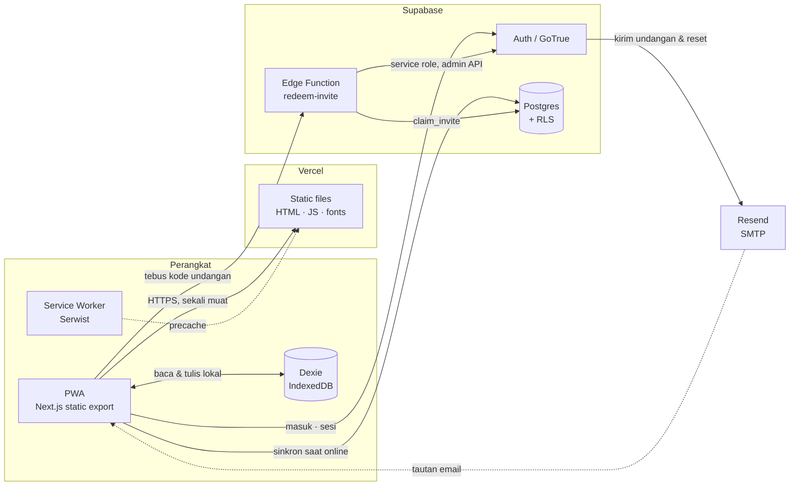
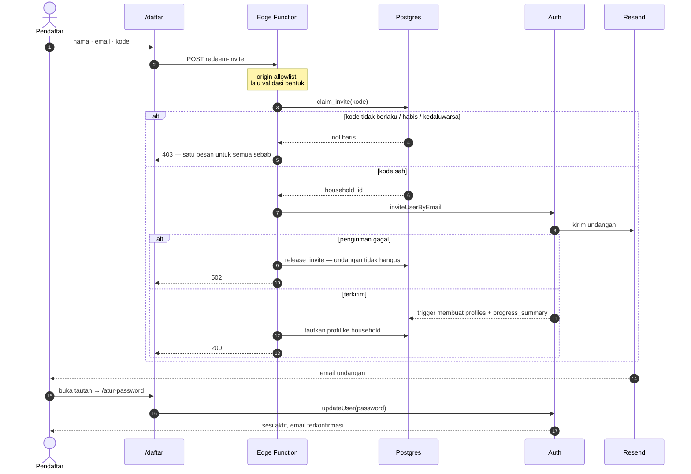
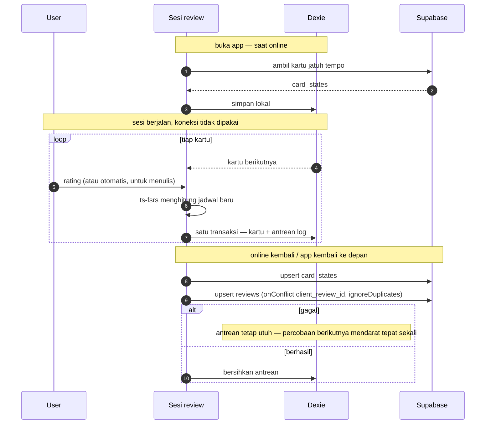
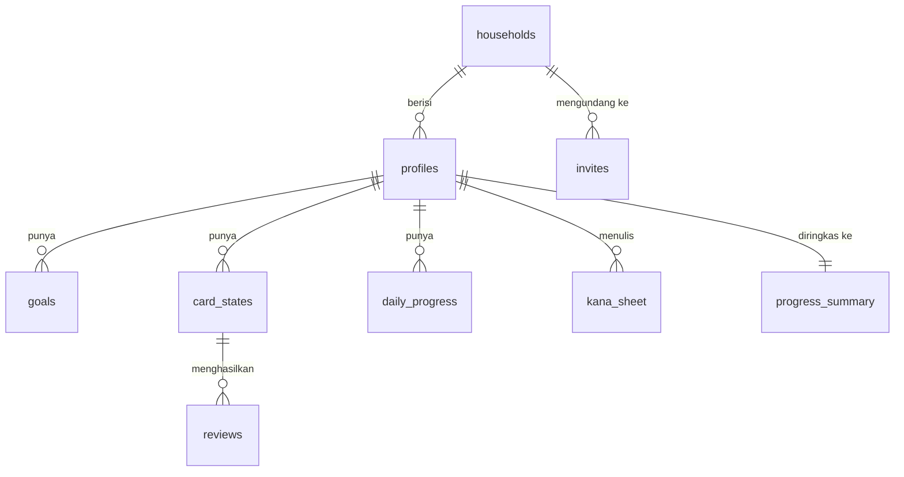

# Masume — architecture

The source of truth for how this system fits together. It lives in the repo so it
changes in the same commit as the code it describes; a diagram kept anywhere else
drifts the moment someone forgets to update it.

GitHub renders the Mermaid blocks below directly.

**Last verified against production:** 5 August 2026 — auth flow end to end (invite →
email → set password → session), Edge Function origin allowlist, offline sync tests,
and both signup doors probed directly.

---

## 1. The whole system

One fact shapes everything else: **there is no server tier**. `output: 'export'`
means Vercel serves static files and nothing more — no API routes, no middleware, no
server components that fetch. Every read and write goes from the browser straight to
Supabase.

That has one hard consequence, and it is worth stating plainly: **RLS is the only
security boundary.** Route guards in the client are a presentation concern; anyone
can walk past them with devtools.

**Why each piece is there**

| Piece | Reason it exists |
|---|---|
| Static export | One build serves Vercel *and* drops into a Capacitor WebView in Phase 1/2 without a rewrite |
| Dexie | Reviewing on a train is the main use case, not an edge case |
| Service worker | Home-screen install, offline shell |
| Edge Function | The only thing that may hold the service role key |
| Resend | Supabase's built-in SMTP is capped at 2 emails/hour and documented as test-only |

---

## 2. Getting an account

Two doors exist, and only one is ours.

The page always demands an invite code, and the code is checked **inside the Edge
Function** — never in the browser, because anything checked in the browser can be
walked past.

But `/auth/v1/signup` is Supabase's own endpoint and answers regardless of our page,
so the invite code is only meaningful while **"Allow new users to sign up" is off**.

Both doors were probed directly on 5 August 2026:

| Door | Probe | Result |
|---|---|---|
| `/auth/v1/signup` | POST with a deliberately short password | `422 signup_disabled` — closed |
| Edge Function → admin API | invite an address that already has an account | `409 already registered` — still reaching GoTrue, so unaffected |

The second probe is the one worth keeping: it proves closing the side door did not
close the front one. A `signup_disabled` there would have meant invitations were
broken too, and nobody would have found out until the next person tried to join.

**Three details that matter**

- **No password passes through the Edge Function.** It sends an invitation; the
  recipient sets a password from the emailed link. Email verification becomes part of
  the flow rather than a step that can be skipped.
- **`claim_invite` is a conditional UPDATE**, so two people racing for the last use
  cannot both win.
- **One rejection message for every reason.** Telling an unauthenticated caller
  apart "no such code" from "already used" hands them a way to probe the table one
  guess at a time.

---

## 3. The daily loop, offline first

The session never touches the network. It reads from IndexedDB and writes to a local
queue; syncing happens later, in the background, or not today.

Every queued row carries a **client-minted id**. That is the whole idempotency story:
a retried push writes the same key, the unique constraint absorbs it, and a flaky
connection can neither duplicate nor lose a review.

Conflict handling: `reviews` is append-only so merging is trivial; `card_states`
is last-write-wins on `last_review`.

---

## 4. Who can see what

The Family Dashboard needs three people readable side by side, but nobody needs to
know which cards you keep forgetting. So the handful of numbers the dashboard shows
are denormalised into `progress_summary`, and everything else stays private.

| Tabel | Sekeluarga boleh lihat | Alasan |
|---|---|---|
| `profiles` | ✅ | Nama dan streak — inti Family Dashboard |
| `daily_progress` | ✅ | "Hari ini sudah berapa" |
| `progress_summary` | ✅ | Satu-satunya jendela lintas-anggota, sengaja sempit |
| `goals` | ❌ | Tanggal ujian orang lain tidak relevan |
| `card_states`, `reviews` | ❌ | Tak ada yang perlu tahu kartu mana yang kamu lupa terus |
| `kana_sheet` | ❌ | Itu tulisan tangan pribadi |
| `invites` | ❌ **nol policy** | RLS aktif tanpa policy = tertutup total; hanya service role |

`current_household_id()` must be `security definer`, or the policy on `profiles`
calls itself while evaluating `household_id` and recurses until Postgres gives up.

---

## 5. Traps this system has already fallen into

Kept because each one cost real time and none of them announce themselves.

| Trap | Symptom | Guard now in place |
|---|---|---|
| **BOM in a Vercel env var** | PowerShell prepends U+FEFF when piping to a native command. A URL starting with a BOM is not absolute, so `fetch` treats it as *relative* and sends every request to our own origin. Supabase logs stay empty because nothing arrives. | `cleanEnv()` strips it and the URL shape is validated at startup; `functionsUrl()` derives from the validated origin |
| **`detectSessionInUrl: false`** | Every invitation and reset link lands on a page that can only conclude it was already used | Explicitly on, with a comment saying why |
| **Public signup left enabled** | Invite code becomes decoration; anyone can POST to `/auth/v1/signup`. It stayed on for hours because it was assumed rather than checked | Toggle is off, and the probe that proves it is written down above so it can be re-run rather than remembered |
| **`revoke ... from public`** | Not enough on Supabase: `anon` and `authenticated` also get direct grants, so a function stays callable after the revoke appears to have closed it | Named explicitly in `0002`, verified with `has_function_privilege` |
| **`for all` policies** | Also cover SELECT, leaving two permissive SELECT policies that both run per row | Split into INSERT/UPDATE/DELETE in `0003` |

---

## 6. What is not built yet

Stated plainly so the diagrams are not read as a description of finished work.

- Content tables (`items`, `item_examples`) — migration `0002` in PRD terms, not written
- Kana seeding into `card_states`
- The core screens: Lembar Kana, the three-stage writing module, the review session,
  Hari Ini with real data, Setelan
- Japanese font subsetting — 13.5 MB currently ships, which the offline precache
  would swallow whole
- PNG icons at 192/512; the manifest currently ships an SVG only, and
  "Add to Home Screen" is untested

Closed since the first version of this document: public signup is now disabled, and
diagram 2 is drawn accordingly.
