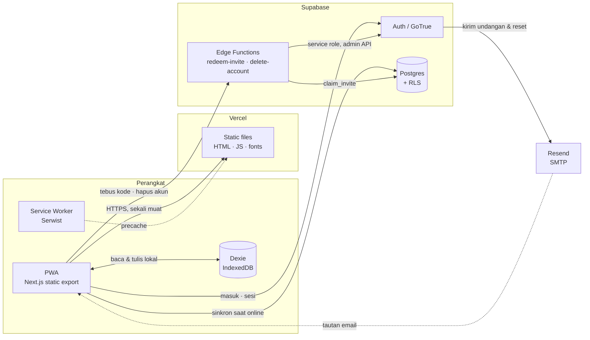
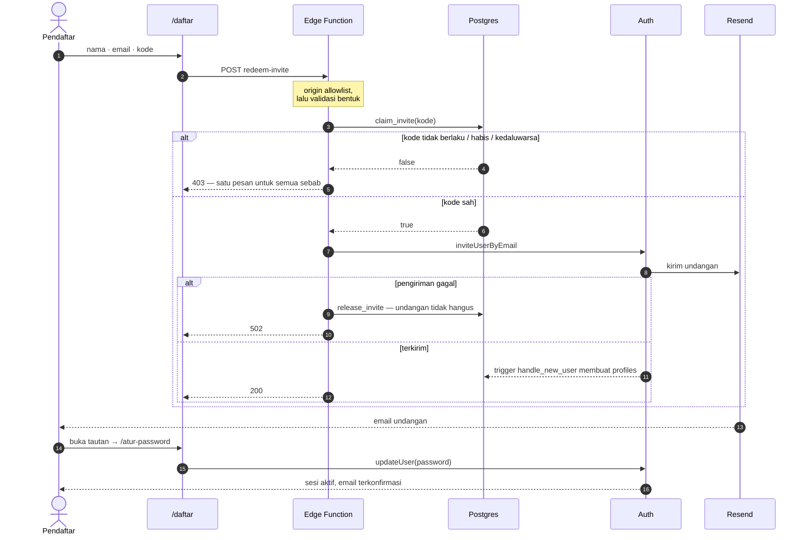
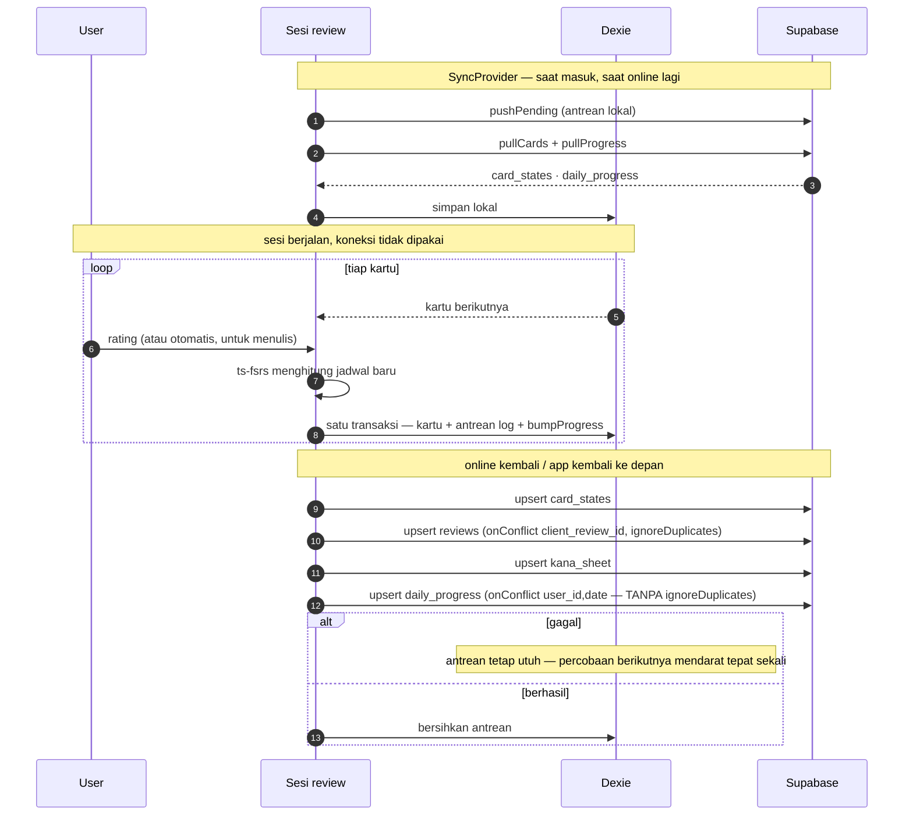
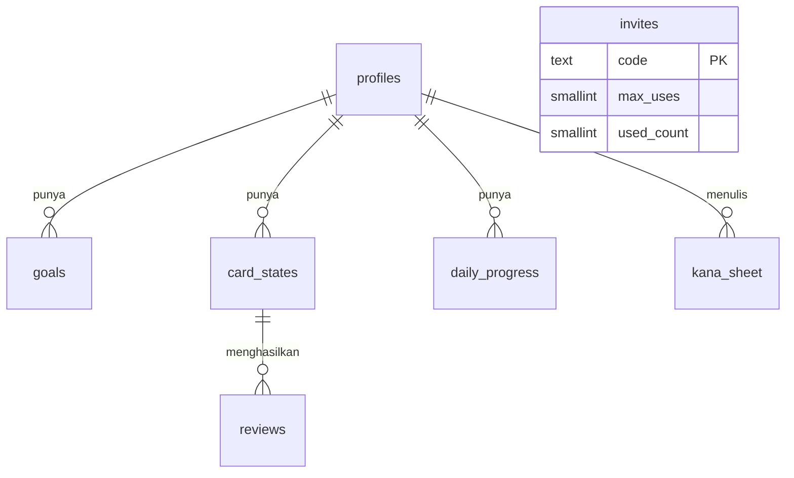

# Masume — architecture

The source of truth for how this system fits together. It lives in the repo so it
changes in the same commit as the code it describes; a diagram kept anywhere else
drifts the moment someone forgets to update it.

GitHub renders the Mermaid blocks below directly.

**Last verified against production:** 6 August 2026, after Sprint 1 — migration
`0007` applied (`goals.baseline_new_per_day`, `set_active_goal` RPC), onboarding
and the review session live on masume.vercel.app, 149 tests green and `tsc`
clean, an end-to-end offline run (six cards answered with no network, six unique
`client_review_id` rows landing after reconnect, re-synced three times with no
duplicates), the ten PWA installability conditions met, and Hari Ini's three
states walked on a real account with the data restored afterwards.

Verified 5 August 2026 and still standing: migrations `0005`+`0006` (households
and `progress_summary` gone, every policy own-rows-only), `redeem-invite` v3 and
`delete-account` v1 deployed, auth flow end to end (invite → email → set password
→ session), Edge Function origin allowlists, and both signup doors probed
directly.

---

## 1. The whole system

One fact shapes everything else: **there is no server tier**. `output: 'export'`
means Vercel serves static files and nothing more — no API routes, no middleware, no
server components that fetch. Every read and write goes from the browser straight to
Supabase.

That has one hard consequence, and it is worth stating plainly: **RLS is the only
security boundary.** Route guards in the client are a presentation concern; anyone
can walk past them with devtools.

**Why each piece is there**

| Piece | Reason it exists |
|---|---|
| Static export | One build serves Vercel *and* drops into a Capacitor WebView in Phase 1/2 without a rewrite |
| Dexie | Reviewing on a train is the main use case, not an edge case |
| Service worker | Home-screen install, offline shell |
| Edge Functions | The only things that may hold the service role key — one to enter (`redeem-invite`), one to leave (`delete-account`) |
| Resend | Supabase's built-in SMTP is capped at 2 emails/hour and documented as test-only |

### The screens

Eleven routes, each its own document — `output: 'export'` means there is no such
thing as a shared server-rendered shell, and a route boundary costs a full
reload.

| Route | What it is | Guard |
|---|---|---|
| `/` | Hari Ini — the day's quota, the streak strip, one CTA | auth + goal |
| `/mulai/` | Onboarding: level, exam sitting, the plan it implies | auth |
| `/sesi/` | Review session — recognition and recall | auth + goal |
| `/menulis/` | Writing practice: demo → trace → recall on canvas | auth |
| `/kana/` | Lembar Kana, the gojūon sheet you fill in yourself | auth |
| `/setelan/` | Profile, sign out, delete account | auth |
| `/masuk/` · `/daftar/` | Sign in · redeem an invite code | public |
| `/lupa-password/` · `/atur-password/` | Reset request · set a password from an emailed link | public |
| `/tentang/` | Licence attribution — reachable without an account by design | public |

`RequireGoal` sits on exactly two of them: `/` and `/sesi/`. Both print quotas,
and a quota with no target is a number with no source. It is deliberately **not**
on `/kana/`, `/menulis/` or `/setelan/` — those work fine before onboarding, and
putting Setelan behind it would trap anyone who cannot finish onboarding,
including someone who needs to sign out and try another account.

Onboarding is two steps inside **one** route, with the step number in component
state. That is the export constraint showing through: two routes would mean
reloading the whole app mid-flow and dropping the choice not yet saved.

---

## 2. Getting an account

Registration is self-serve, but gated: **the invite code is the credential**. That
is the whole auth story of signing up — which is why `verify_jwt` is off on
`redeem-invite` (someone signing up cannot possibly present a JWT yet), and why the
code is checked **inside the Edge Function**, never in the browser, because anything
checked in the browser can be walked past. Opening registration to the public —
dropping the code — is a later phase, and needs rate limiting and bot protection
first.

`/auth/v1/signup` is Supabase's own endpoint and answers regardless of our page, so
**"Allow new users to sign up" stays off** in the dashboard; the admin API inside
the Edge Function is the only way a user row can come into existence. Both doors
were probed directly on 5 August 2026:

| Door | Probe | Result |
|---|---|---|
| `/auth/v1/signup` | POST with a deliberately short password | `422 signup_disabled` — closed |
| Edge Function → admin API | invite an address that already has an account | `409 already registered` — still reaching GoTrue, so unaffected |

The second probe is the one worth keeping: it proves closing the side door did not
close the front one. A `signup_disabled` there would have meant invitations were
broken too, and nobody would have found out until the next person tried to join.

**Three details that matter**

- **No password passes through the Edge Function.** It sends an invitation; the
  recipient sets a password from the emailed link. Email verification becomes part of
  the flow rather than a step that can be skipped.
- **`claim_invite` is a conditional UPDATE returning a boolean**, so two people
  racing for the last use cannot both win — and since the generalisation there is no
  household to return or link. The signup trigger creates the profile row and the
  function's work is done; an account is just an account.
- **One rejection message for every reason.** Telling an unauthenticated caller
  apart "no such code" from "already used" hands them a way to probe the table one
  guess at a time.

---

## 3. Leaving: delete-account

Both stores require it — App Store guideline 5.1.1(v) and Google Play's
data-deletion policy both say an account created in the app must be deletable from
the app. `delete-account` is that path, reached from Setelan behind a typed
confirmation.

Its security model is one sentence: **the JWT is both the authentication and the
target.** `verify_jwt` is on at the gateway, the function resolves the caller from
their own token (`getUser()` as defense in depth), and no user id is accepted from
the body — so the caller can only ever delete themselves. The service-role client
then calls `admin.deleteUser`, and every user-keyed table (`profiles`, `goals`,
`card_states`, `reviews`, `daily_progress`, `kana_sheet`) carries
`ON DELETE CASCADE` to `auth.users`, so the data goes with the account atomically —
nothing left behind to sweep up later. The client finishes the job on its side:
Dexie `clearAll()` wipes IndexedDB before the local sign-out.

---

## 4. The daily loop, offline first

The session never touches the network. It reads from IndexedDB and writes to a local
queue; syncing happens later, in the background, or not today.

Every queued row carries a **client-minted id**. That is the whole idempotency story:
a retried push writes the same key, the unique constraint absorbs it, and a flaky
connection can neither duplicate nor lose a review.

### The local store

Dexie database `masume`, now at **version 2**. Version 1 holds `cards`,
`reviewQueue`, `pendingCards`, `kanaSheet`, `pendingKana`, `meta`; version 2 adds
`dailyProgress` and `pendingProgress`. Adding a version is safe — existing stores
carry forward untouched. Renaming the *database* is not: it orphans every local
copy that exists, which is only survivable while nobody has data yet.

`dailyProgress` is keyed by `date` alone rather than `[user_id+date]`, because
`SyncProvider` wipes the whole database when the account changes, so the store only
ever holds one user. `user_id` still rides on the row, because the server's primary
key needs it.

Two of its columns never leave the device and are stripped before upload — the
server has no such columns, and PostgREST rejects the whole batch over an unknown
field rather than ignoring it:

- `ms` — a millisecond accumulator. Rounding each card to whole minutes yields zero
  for every card, so the fraction is carried here and only surfaces as `minutes`.
- `new_done_items` — items *released* today, deliberately not the same number as
  `new_done`, which counts cards answered. One item becomes two cards, and the
  session has to know how much of the day's allowance it already handed out.

### SyncProvider: push, then pull

`SyncProvider` owns the lifecycle of the local database — wipe it when the account
changes, fill it from the server, drain it back when the connection allows. Until
it existed, `pullCards` and `watchForSync` **had no caller anywhere in the app**:
Dexie was only ever populated by work done on that same device, so signing in on a
second phone showed an empty review queue over cards that were perfectly real and
living on the first one.

**The order is push, then pull, always.** `pullCards` hydrates with `bulkPut`, so a
pull that runs first overwrites card states that have not been uploaded yet —
silently discarding reviews the user already answered. Draining the queue first
makes the server the newer copy before we accept it back.

The account guard (`guardLocalData`) moved here from `AuthProvider` for the same
class of reason. They used to be two independent effects, and React runs child
effects before parent effects, so the guard could wipe cards a pull had just
written. Ordering by luck is not ordering.

`watchForSync` fires on regaining connectivity and on returning to the foreground.
Not a polling interval — those are the only two moments that change the answer.

### The four sync blocks

`syncPending` pushes in a fixed order, because `reviews` reference `card_states`.

| # | Table | onConflict | Why |
|---|---|---|---|
| 1 | `card_states` | `user_id,item_id,mode` | Cards first; reviews point at them |
| 2 | `reviews` | `user_id,client_review_id` + `ignoreDuplicates` | An append-only fact: a re-send must be a no-op |
| 3 | `kana_sheet` | `user_id,item_id` | One cell, one row |
| 4 | `daily_progress` | `user_id,date`, **no** `ignoreDuplicates` | A running total: a re-send carries the NEWER numbers and has to overwrite |

The contrast between blocks 2 and 4 is the thing to keep hold of, and the thing
most likely to be copied wrong. `daily_progress` goes last on purpose: nothing
references those rows, and losing one costs a summary that can be rebuilt from
`reviews` — unlike the three above it.

`pullProgress` is the other half. The queue had a push side and no pull side, so
the streak strip read zero on any device that had not personally written the rows:
a new phone showed a week of empty squares over days the person had actually
studied. `mergeProgress` lets local rows win, because the local copy may hold
counts that have not been uploaded yet.

Conflict handling: `reviews` is append-only so merging is trivial; `card_states`
is last-write-wins on `last_review`.

### Days are local days

`daily_progress.date` is a **local** calendar date, derived through `src/lib/day.ts`
with `Intl` and the learner's own `profiles.timezone`. `toISOString().slice(0, 10)`
is the obvious answer and the wrong one: in Asia/Jakarta it rolls over at 07:00, so
a session at 9pm lands on tomorrow's row and the streak shows a gap on a day that
was actually studied. The bug is visible only between midnight and 7am WIB — which
is to say, never during the hours anyone would test it.

`overdueBefore` counts in calendar days for the same reason: a card due at 11pm
yesterday is a card from yesterday, even when it is only nine hours old.

### The session queue

`src/lib/session.ts` is pure — no Dexie, no React, no network. The screen fetches
the rows and applies the effects; the module decides only what comes next and what
that answer means. That split is what makes "what happens if someone quits on card
fourteen" a test rather than a guess.

**Reviews first**, oldest due first: a review is a debt, and someone who stops
halfway should have paid it rather than met new material they will then forget.
**New cards grouped by mode**, so every recognition in today's batch comes before
any of its recalls — put recognition あ next to recall あ and the recall is answered
from the previous card rather than from memory.

Writing cards are split out into `canvas` and handed to `/menulis/` from the summary
screen. The split is by **interaction cost, not mode name**, and it lives in a
`CANVAS_MODES` constant: a recognition card is a tap, a writing card is a canvas for
thirty seconds a stroke at a time, and mixing them breaks the four-minute session
outright. Dropping writing from the daily flow entirely would be worse, because FSRS
schedules those cards like any other and they would pile up unseen until the
schedule stopped meaning anything. Sprint 2 adds `listening` to the fast side and
kanji writing to the canvas side; nothing else in the file changes.

Two smaller rules with sharp edges:

- **`hintBudget` = grapheme count − 1**, never the last hidden cell. A hint that
  completes the answer is a reveal in disguise, and it quietly inflates the rating
  the user then gives themselves. A one-character kana gets zero, so the button is
  not offered at all.
- **Again replays a card once, at the tail** — once, not a loop. A bad night has to
  be able to end.

### What the shell serves

The static payload is part of the offline story, so it belongs here.

**Fonts are self-hosted and subset.** `scripts/subset-fonts.mjs` pulls exactly the
glyphs the app uses through the Google Fonts CSS API (`text=`), and the result is
committed: six woff2 files, 138 KB, down from 865 files and 13.2 MB.
`next/font/google` is gone from the layout, replaced by real `@font-face` rules in
`globals.css`. That was a bug fix rather than a size optimisation — see the traps
table. Only the body face is preloaded; preloading all six would repeat the mistake
at a smaller scale. `npm run fonts` regenerates, `npm run verify:fonts` checks.

**Icons are committed rasters**, produced by `npm run icons`
(`scripts/render-icons.mjs`): `icon-192.png`, `icon-512.png`,
`icon-maskable-512.png`, `apple-touch-icon.png`. Chrome refuses the install prompt
without a raster of at least 192px, so an SVG-only manifest meant the app could be
used and never installed. `any` and `maskable` are **separate entries**: declaring
one icon `"any maskable"` tells Android it may crop that art to a circle *and* use
the same file untouched elsewhere, so it gets shrunk-with-padding in the places that
do not crop. iOS ignores the manifest's icons entirely and reads the
`apple-touch-icon` link, without which an installed app gets a screenshot of the
page as its home-screen icon.

**The service worker claims navigations first.** In `src/sw.ts` the navigation rule
sits ahead of `defaultCache` — a `NetworkFirst` handler filling a `pages` cache —
plus a `fetch` listener that redirects any `.txt` URL committed as a document to the
route it belongs to. The precache holds 50 entries and **no HTML at all**, so every
navigation fell through to runtime caching where the only page-shaped caches were
`pages-rsc` and `pages-rsc-prefetch`; nothing was left that could answer with a
document. Claiming navigations first closes that off by construction, and it also
fixes offline navigation, which never worked: a route opened once now opens again on
a train.

---

## 5. Who can see what

Since the generalisation the answer is uniform: **your own rows, nothing else.**
Migration `0005` dropped the family machinery — the `households` table, the
denormalised `progress_summary` that existed only so family members could read each
other's numbers, the `household_id` columns, and the `current_household_id()`
helper — and collapsed every policy to owner-only. Shorter policies are harder to
get wrong.

| Tabel | Siapa boleh lihat | Policy |
|---|---|---|
| `profiles` | Pemiliknya saja | `id = auth.uid()` |
| `goals`, `card_states`, `reviews`, `daily_progress`, `kana_sheet` | Pemiliknya saja | `user_id = auth.uid()` |
| `invites` | **Tidak seorang pun** — nol policy | RLS aktif tanpa policy = tertutup total; hanya service role di Edge Function |

`invites` stands alone in the diagram on purpose: since `0005` it references
nothing — a code is a bearer credential for a signup, not a membership in anything.

**Switching the active goal is an RPC, not two client writes.**
`goals_one_active_per_user` is a *partial* unique index (`WHERE is_active`), which
makes both orderings wrong from the browser: insert-then-deactivate violates the
index and fails outright, and deactivate-then-insert leaves a window with no active
goal at all — during which `RequireGoal` throws the user back into onboarding with
half their history already written. PostgREST has no cross-request transaction, so
migration `0007` puts the atomicity in the database as `set_active_goal(text, date,
integer)`. It is `security invoker`, deliberately: RLS `goals_all_own` stays the
thing that decides whose rows these are, and the function only needs to be one
statement, not privileged. EXECUTE is revoked from `public` and `anon` the same way
`0002` and `0006` do it.

---

## 6. One dictionary, every string

All UI strings live in `src/lib/i18n/id.ts` as a typed dictionary —
`Dictionary = typeof id`, so the Indonesian file *is* the schema. Components read it
through `useT()`; module-scope code (error tables, manifest, metadata) imports `t`
directly.

The payoff is the shape of a future locale: a second language is a sibling file
declared `satisfies Dictionary` — the compiler lists every missing or extra key —
and the only file that changes behaviour is `src/lib/i18n/index.ts`, where `useT()`
starts picking a dictionary by locale. No component gets touched.

---

## 7. Files first, then production

`supabase/functions/` and `supabase/migrations/` are **the source of truth**.
Changing a function means editing the file, committing, then deploying that file's
content verbatim; schema changes ride the same rule — the migration file is written
to the repo first, then applied under the same name. Never from an editor buffer,
never straight into the dashboard.

The rule exists because it was broken once: `redeem-invite` was deployed from a
session buffer and `0004` applied the same way, leaving the only door into the app
living exclusively in production with no reviewable, diffable, revertible copy
anywhere. Reconstructing them from live introspection took a session; the rule is
cheaper.

---

## 8. Traps this system has already fallen into

Kept because each one cost real time, and every one of them meets the bar for this
table: **the symptom does not point at the cause.**

| Trap | Symptom | Guard now in place |
|---|---|---|
| **BOM in a Vercel env var** | PowerShell prepends U+FEFF when piping to a native command. A URL starting with a BOM is not absolute, so `fetch` treats it as *relative* and sends every request to our own origin. Supabase logs stay empty because nothing arrives. | `cleanEnv()` strips it and the URL shape is validated at startup; `functionsUrl()` derives from the validated origin |
| **`detectSessionInUrl: false`** | Every invitation and reset link lands on a page that can only conclude it was already used | Explicitly on, with a comment saying why |
| **Public signup left enabled** | Invite code becomes decoration; anyone can POST to `/auth/v1/signup`. It stayed on for hours because it was assumed rather than checked | Toggle is off, and the probe that proves it is written down above so it can be re-run rather than remembered |
| **`revoke ... from public`** | Not enough on Supabase: `anon` and `authenticated` also get direct grants, so a function stays callable after the revoke appears to have closed it | Named explicitly in `0002`, verified with `has_function_privilege` |
| **`for all` policies** | Also cover SELECT, leaving two permissive SELECT policies that both run per row | Split into INSERT/UPDATE/DELETE in `0003` |
| **Two navigations committed at once** | A screenful of raw `1:"$Sreact.fragment"` — the RSC route payload, painted as a page. Two users hit it. Signing out fired a hard navigation *and* a `router.replace` from RequireAuth, whose in-flight `.txt` fetch iPhone Safari then committed as the document. Nothing in the text names sign-out, routing, or Safari. | `beginSignOut()` / `isLeaving()` in `auth-provider`; both guards stand down while a departure is in flight. Two more layers in the service worker: navigations are claimed before any other rule, and a `.txt` committed as a document is redirected to its route |
| **A hashed font family name** | Every screen renders in system-ui, and 13.2 MB of Japanese webfont is downloaded and precached to draw nothing. `--font-gothic` named the literal family while `next/font/google` registered a hashed one, so the token matched no font that existed — and "the font token is set" reads as correct in every file you would think to open | `next/font` removed from the layout; real `@font-face` rules with real family names in `globals.css`, over subset files committed in `public/fonts`. `npm run verify:fonts` |
| **`dayState` congratulating an untouched day** | A brand-new account has no cards, so "nothing is due" is true of it — and the first screen it ever showed stamped 済 over a day with no work in it *and* hid the only button that could start one. New users were trapped by a success state | `selesai` now requires `doneToday > 0` or `newPerDay === 0`. Nothing due is not the same fact as nothing left to do |
| **A queue with a push side and no pull side** | Streak strip reads zero on a new phone — a week of empty squares over days the person genuinely studied. The rows exist; they are just on the other device. Looks like data loss, is a missing fetch | `pullProgress()` in `SyncProvider`, with `mergeProgress()` letting local rows win |
| **`saveWriting` not calling `bumpProgress`** | A day spent entirely on writing practice shows an empty streak square. The work was saved — `kana_sheet` and `card_states` are both correct — only the daily tally never heard about it | `saveWriting` bumps the daily row like `saveReview` does; both paths tested |
| **New-card allowance handed out per mount** | `started` was a ref, so a reload or a second tab granted the day's new cards again — opening the session three times released three days of material, silently blowing up tomorrow's review load rather than today's screen | Counted in `new_done_items` on the local daily row, which survives a reload in a way a component ref cannot |
| **`pendingCount().total` in the sign-out warning** | "42 latihan akan hilang" after a session that answered six cards. The total also counts card-state and daily-summary rows, which are bookkeeping — the number is both wrong and frightening, and it appears at the exact moment someone is deciding whether to trust the app with their data | Warns on `reviews + kana` only: work the person actually did |
| **`quota_target` in the wrong unit** | A finished day reads 200% complete. `newPerDay` counts *items*, `new_done` counts *cards*, and one kana item becomes two cards on the fast path — so the row compares two different units and neither number looks wrong on its own | The target is stored as a count of queued cards |

---

## 9. What is not built yet

Stated plainly so the diagrams are not read as a description of finished work.

- **The listening mode.** `MODE_RANK` already holds a slot for it, but nothing
  generates the cards and no screen plays audio
- **The vocabulary, kanji and grammar datasets.** The JSON files exist; the content
  tables do not. `items` and `item_examples` are still unwritten migrations, held
  deliberately until the Japan Arena N3 schema has been seen — locking the shape
  first is how you earn a second migration
- **Curriculum Path for N5**, including the 95%-accuracy gate out of kana. Kana is
  currently the only track with content, and onboarding shows only tracks that have
  any
- **Public registration** without an invite code, which needs rate limiting and bot
  protection first
- **A second locale.** The infrastructure is ready — a sibling file declared
  `satisfies Dictionary` — but no dictionary is written
- **The Capacitor shell** for Android and iOS. The storage adapter has been kept
  swappable from the start for this

Built since the previous revision, and no longer on this list: the review session,
Hari Ini reading real data, Japanese font subsetting, and PNG icons.

### Resolved: stroke counts now match Japanese teaching, 150 of 150

`@k1low/hanzi-writer-data-jp` derives from Make Me a Hanzi and animCJK, which
decompose strokes from Chinese font outlines. Audited against KanjiVG, **21 of 150
characters disagreed** — and not randomly: every one had a closed loop, which that
data splits into two strokes where Japanese handwriting draws one.

    あ 4→3   お 4→3   す 3→2   な 5→4   ぬ 4→2   ね 3→2   の 2→1
    は 4→3   ほ 5→4   ま 4→3   み 3→2   む 4→3   め 3→2   よ 3→2
    る 2→1   + dakuten forms ず ば ぱ ぼ ぽ ょ

The fix was to move to KanjiVG outright rather than patch a table by hand. Its paths
are **centrelines**, not outlines, so one dataset now draws the character, animates
it, and serves as the skeleton the scorer grades against — with nothing to keep in
sync and one dependency fewer. `npm run verify:strokes` reports 150 of 150 matching.

Two direction bugs surfaced during the move and were fixed with it. The old data
needed a y flip, and both the offset wording ("ke atas" / "ke bawah") and the
reference-direction phrases had been written against the flipped axis — so every one
of them described the opposite of what it meant. KanjiVG uses ordinary SVG
orientation, and the coordinate contract is now stated at the top of
`stroke-score.ts`.

Closed since the first version of this document: public signup is now disabled, and
diagram 2 is drawn accordingly.
